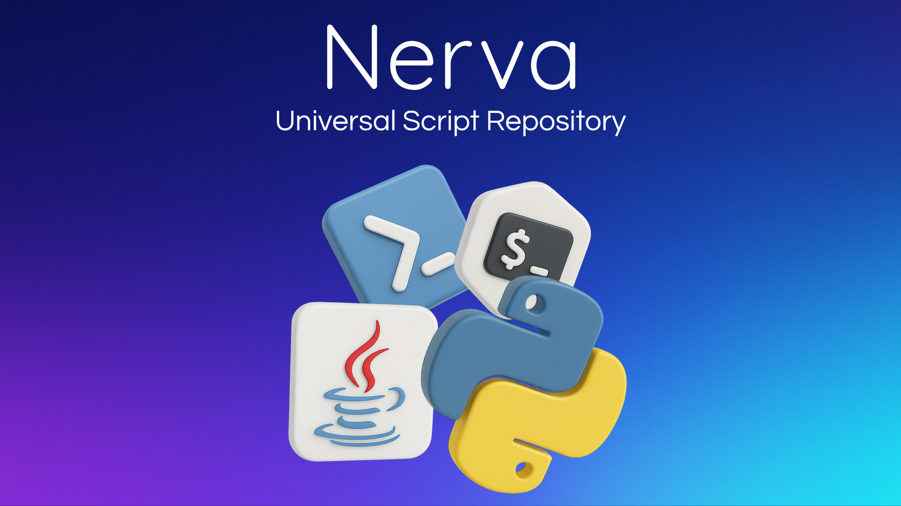

# ✅ Nerva – Universal Script Repository

<p align="center">
  
</p>

<p align="center"><strong>A curated collection of practical scripts across multiple programming languages.</strong></p>


<p align = "center">
  
        
  
</p>

---

## 🌐 Overview

Nerva is an open-source repository of ready-to-use scripts for:

* ✅ Automation
* 🔐 Security Testing
* 🌐 Networking
* 📁 File Management
* and more!

All scripts are organized by programming language and come with documentation to help you get started fast.

---

## 📚 Available Scripts

| Language       | Script Name                      | Description                              | Location                                                              |
| -------------- | -------------------------------- | ---------------------------------------- | --------------------------------------------------------------------- |
| **Python**     | 🤖 Script Manager                | Manage this repo & generate web views    | [python/script-manager](scripts/python/script-manager/)               |
|                | 🔒 FTP Scanner                   | Scan for anonymous FTP logins            | [python/ftp-scanner](scripts/python/ftp-scanner/)                     |
|                | 🛡️ SHADOW Vulnerability Scanner | Scan websites using template-based rules | [python/vulnerability-scanner](scripts/python/vulnerability-scanner/) |
|                | 🌐 URL Status Checker            | Check availability of multiple URLs      | [python/url-status-checker](scripts/python/url-status-checker/)       |
|                | 📁 File Organizer                | Organize files by type and date          | [python/file-organizer](scripts/python/file-organizer/)               |
|                | 🔍 Duplicate Finder              | Find and handle duplicate files easily   | [python/duplicate-finder](scripts/python/duplicate-finder/)           |
|                | 📧 Email Automation              | Send automated emails using templates    | [python/email-automation](scripts/python/email-automation/)           |
|                | 🔐 Password Generator            | Create strong, random passwords          | [python/password-generator](scripts/python/password-generator/)       |
|                | 📶 Auto WiFi Check               | Reconnect WiFi automatically             | [python/auto-wifi-check](scripts/python/auto-wifi-check/)             |
| **JavaScript** | *(Empty)*                        | Add your script!                         | [javascript](scripts/javascript/)                                     |
| **Bash**       | *(Empty)*                        | Add your script!                         | [bash](scripts/bash/)                                                 |
| **PowerShell** | *(Empty)*                        | Add your script!                         | [powershell](scripts/powershell/)                                     |

> 💡 **Want to contribute?** Just fork the repo and open a PR. It’s that easy!

---

## 🗂️ Folder Structure

```
Nerva/
├── scripts/
│   ├── python/
│   │   ├── ftp-scanner/
│   │   ├── vulnerability-scanner/
│   │   └── url-status-checker/
│   ├── javascript/
│   ├── bash/
│   └── powershell/
├── assets/
├── script_manager.py
└── README.md
```

---

## 🚀 Getting Started

### To Use a Script:

1. Go to the folder for your preferred language
2. Pick a script
3. Follow the `README.md` inside the script folder

### To Add a Script:

1. **Fork this repo**
2. **Create a new script** inside the appropriate folder
3. **Add a README** using our [template](scripts/python/script-manager/README.md)
4. Run this command:

   ```bash
   python script_manager.py build
   ```
5. **Create a Pull Request**

> ✅ The `script_manager.py` tool takes care of linking, organizing, and updating the website view!

---

## 🧠 Script Manager

Our **Script Manager** automates the entire process of:

* Generating index pages
* Keeping structure and metadata updated
* Showing scripts on a dynamic website with 3D cards!

### Key Commands:

| Command                                      | What it does                    | When to use                   |
| -------------------------------------------- | ------------------------------- | ----------------------------- |
| `python script_manager.py build`             | 🔄 Rebuild everything           | After adding/changing scripts |
| `python script_manager.py scan`              | 📋 List existing scripts        | To preview structure          |
| `python script_manager.py add <lang> <name>` | 🆕 Create a new script template | Starting from scratch         |

> 💡 **The manager is beginner-friendly** and includes inline help.

---

## 🤝 Contributing

We welcome your scripts! Start by reading our [Contributing Guide](CONTRIBUTING.md).

* Scripts must be functional and tested.
* File names should be descriptive.
* Follow language best practices (e.g., PEP8 for Python).
* Add a `README.md` for your script.

---

## 📄 License

This project is licensed under the **MIT License**. See [LICENSE](LICENSE) for details.

---

<p align="center">
  🙌 Star this repo to support open-source scripting! <br>
  <em>Browse all scripts and contribute at <a href="https://github.com/curiousbud/Nerva">github.com/curiousbud/Nerva</a></em>
</p>
