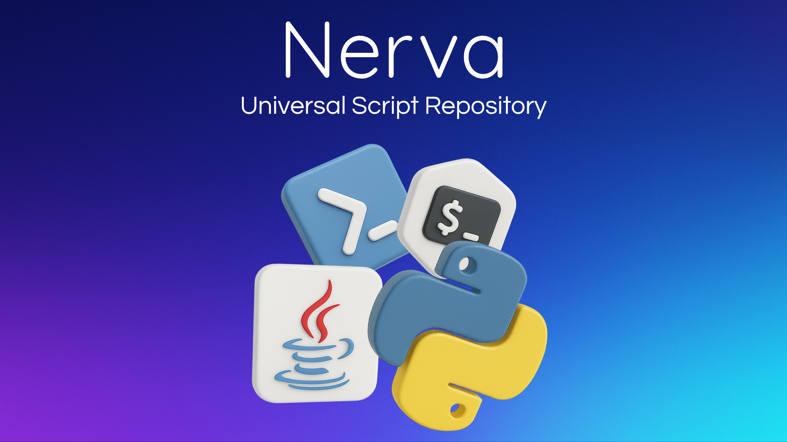

# ✅ Nerva – Universal Script Repository

<p align="center">
  
</p>

<p align="center"><strong>A curated collection of practical scripts across multiple programming languages.</strong></p>


<p align = "center">
  
        
  
</p>

---

## 🌐 Overview

Nerva is an open-source repository of ready-to-use scripts for:

* ✅ Automation
* 🔐 Security Testing
* 🌐 Networking
* 📁 File Management
* and more!

All scripts are organized by programming language and come with documentation to help you get started fast.

---

## 📚 Available Scripts

Scripts are organized **by category, then by tool, then by language** under
[`scripts/`](scripts/). A tool that exists in several languages lives in one
folder, so you can see every implementation side by side:

```
scripts/<category>/<tool>/README.md      # one README for the tool
scripts/<category>/<tool>/<language>/     # the source for each language
```

Current categories: **security**, **networking**, **file-management**,
**automation**, **utility**. Browse everything (with search and filters) on the
[Nerva website](https://github.com/curiousbud/Nerva), or run
`python script_manager.py list` to print the full index.

> 💡 **Want to contribute?** Just fork the repo and open a PR. It’s that easy!

---

## 🗂️ Folder Structure

```
Nerva/
├── scripts/
│   ├── security/
│   │   ├── password-generator/      # one tool…
│   │   │   ├── README.md
│   │   │   ├── python/              # …with several language variants
│   │   │   ├── bash/
│   │   │   └── powershell/
│   │   └── port-scanner/
│   │       ├── README.md
│   │       └── python/
│   ├── utility/
│   ├── networking/
│   ├── automation/
│   └── file-management/
├── assets/
├── script_manager.py
└── README.md
```

---

## 🚀 Getting Started

### To Use a Script:

1. Go to the folder for your preferred language
2. Pick a script
3. Follow the `README.md` inside the script folder

### To Add a Script:

1. **Fork this repo**
2. **Scaffold the tool** (creates the folder, a README, and a starter file):

   ```bash
   python script_manager.py add my-tool python --category utility
   ```
3. **Fill in** the generated `README.md` and source file. To offer the same tool
   in another language, run `python script_manager.py add my-tool bash`.
4. **Regenerate** the registry and website data:

   ```bash
   python script_manager.py build
   ```
5. **Create a Pull Request**

> ✅ The `script_manager.py` tool takes care of linking, organizing, and updating the website view!

---

## 🧠 Script Manager

Our **Script Manager** automates the entire process of:

* Generating index pages
* Keeping structure and metadata updated
* Showing scripts on a dynamic website with 3D cards!

### Key Commands:

| Command                                      | What it does                    | When to use                   |
| -------------------------------------------- | ------------------------------- | ----------------------------- |
| `python script_manager.py build`             | 🔄 Rebuild everything           | After adding/changing scripts |
| `python script_manager.py scan`              | 📋 List existing scripts        | To preview structure          |
| `python script_manager.py add <tool> <lang>` | 🆕 Scaffold a tool / add a variant | Starting a new script      |
| `python script_manager.py list`              | 📜 Summary of indexed tools     | Quick inventory check         |

> 💡 **The manager is beginner-friendly** and includes inline help — run `python script_manager.py --help`.
>
> 📖 Full command reference: [`docs/SCRIPT_MANAGER.md`](docs/SCRIPT_MANAGER.md)

---

## 🤝 Contributing

We welcome your scripts! Start by reading our [Contributing Guide](CONTRIBUTING.md).

* Scripts must be functional and tested.
* File names should be descriptive.
* Follow language best practices (e.g., PEP8 for Python).
* Add a `README.md` for your script.

---

## 📄 License

This project is licensed under the **MIT License**. See [LICENSE](LICENSE) for details.

---

<p align="center">
  🙌 Star this repo to support open-source scripting! <br>
  <em>Browse all scripts and contribute at <a href="https://github.com/curiousbud/Nerva">github.com/curiousbud/Nerva</a></em>
</p>
